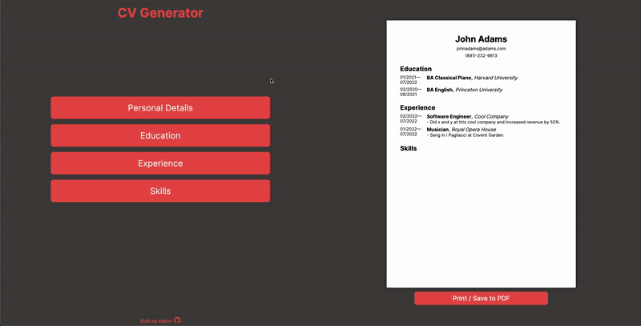

# CV Generator

A resume generator built with React.

Viewable at https://xiejon.github.io/cv-app/

## Objectives 

1. Create an application using the React JavaScript library.
2. Use functional components, managing state with hooks.
3. Generate a CV based on user form input.
4. Allow user to print or PDF export the finished CV.

## Overview

1. User enters information into the form.
2. On submit, the CV preview is updated with the user's input. 
3. The user can enter multiple entries for each category.
4. The entry can be edited by clicking on the div. 
5. A print button allows the user to save or print the final product.

## Challenges 

1. State
    - This project made heavy use of state & props. It was not immediately clear to me how state should be managed, i.e. which component should it reside in, how can it be passed down into children components, etc. Working on this app was priceless in learning these React fundamentals. For example, it is clear to me now that state should be held in the parent of components that require access to the state, which can then be passed down through props. 

2. Print/Export to PDF
    - I struggled implementing this feature. I ran into issues working with the react-pdf library due to missing modules in React v5. Unable to resolve the issues, I ultimately made use of the react-to-print library to print a component on the page. In print options, the user would have the option to save to PDF.

3. Component Organization 
    - I've already fallen in love with React because of how it simplifies DOM manipulation, helping me avoid the spaghetti code of event listeners and querySelectors of my earlier projects. The concept of components in React immediately improves code organization and reusability. In this project, however, I wasn't always sure how to divide my code up in the best way. I wanted to avoid over-compartmentalizing and creating too many components, as I felt that it would only make my code harder to read and defeat the purpose of components in the first place.

## Areas for Improvement

- Export to PDF. I would like to implement a way to save the CV as a PDF directly, without having to go through the browser's print preview.

- CV customization. Ideally, a user could have more control over the layout of the CV. Perhaps, they would even have the option to choose colors, styling, fonts, etc. 